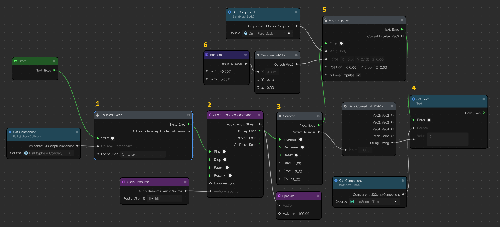

# Bouncing Ball TikTok Effect

 ## Video 
 [Making of Bouncing Ball TikTok Effect](https://youtu.be/Spu23OrPr-o)

>Catatan: Belum ada tambahan penjelasan di dalam video, baru berupa rekaman layar

 ## Visual Script 1
 

[ID]
1. Saat Bola menyentuh Papan, lakukan beberapa hal berikut :
2. Bunyikan suara
3. Naikkan nilai counter untuk menghitung skor
4. Tampilkan di teks skor
5. Berikan gaya ke atas (nilai Y) agar bola terlihat memantul tinggi
6. Berikan gaya acak ke samping (nilai X) agar pantulan agak berubah untuk menambah tantangan

[EN]

1. When the ball hits the board, do the following :
2. Play the audio
3. Increase the counter value to calculate the score
4. Show the score text
5. Apply an upward force (Y value) to make the ball look like it is bouncing higher
6. Apply a random force to the side (X value) to make the bounce change slightly to add to the challenge
 
  ## Visual Script 2
  
  
[ID]
1. Deteksi pergerakan wajah
2. Ambil nilai X saja, karena papan cuma bergerak secara horisontal

> Nilai terkecil posisi wajah paling kiri adalah 0, dan paling kanan
> adalah 1. Sedangkan posisi papan adalah 0 saat di tengah layar, -20
> saat di ujung kiri dan 20 saat di ujung kanan. Oleh karena itu nilai
> posisi wajah harus dikonversi dengan rumus.
> 
> `Xpapan = Xwajah * 40 - 20`
>    
> Sehingga diterapkan dalam script:

3. Kalikan dengan 40 (B = 40)
4. Kurangi dengan 20 (B = 40)
5. Gabungkan nilai X (pergerakan wajah) dengan nilai Y (tetap -15) dan Z tetap 0.
6. Set posisi papan berdasarkan nilai yang sudah diperoleh sebelumnya.

[EN]

1. Detect face movement
2. Take the X value only, because the board only moves horizontally

> The smallest value of the leftmost face position is 0, and the rightmost is 1. While the board position is 0 when in the middle of the screen,  -20 when on the left end and 20 when on the right end. Therefore the face position value must be converted with the formula.
> 
> `Xboard = Xface * 40 - 20`
> 
> So that it is applied in the script:
3. Multiply by 40 (B = 40)
4. Subtract by 20 (B = 40)
5. Combine the X value (facial movement) with the Y value (still -15) and Z remains 0.
6. Set the board position based on the previously obtained value.